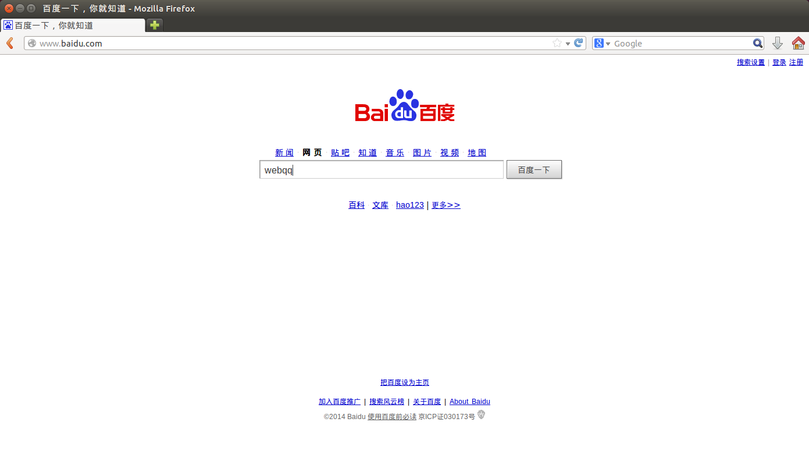
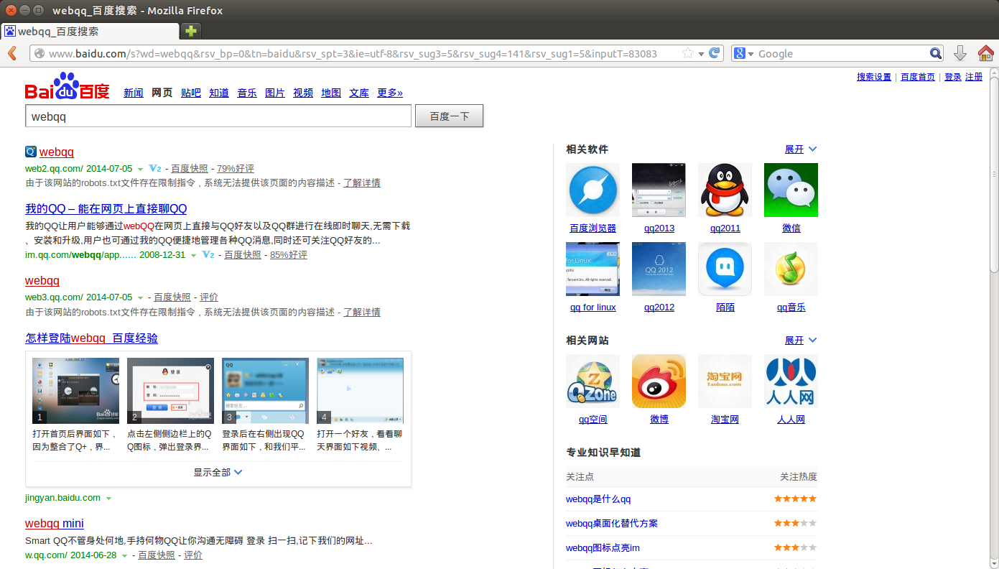
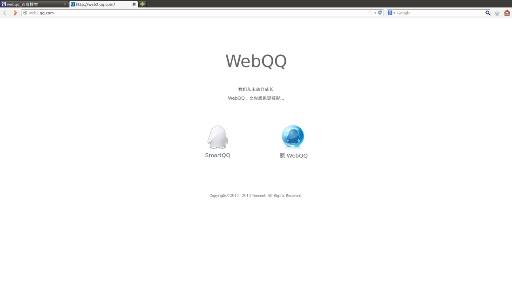
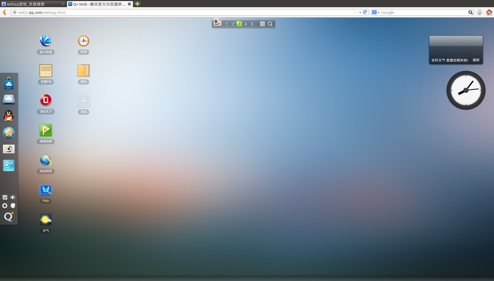
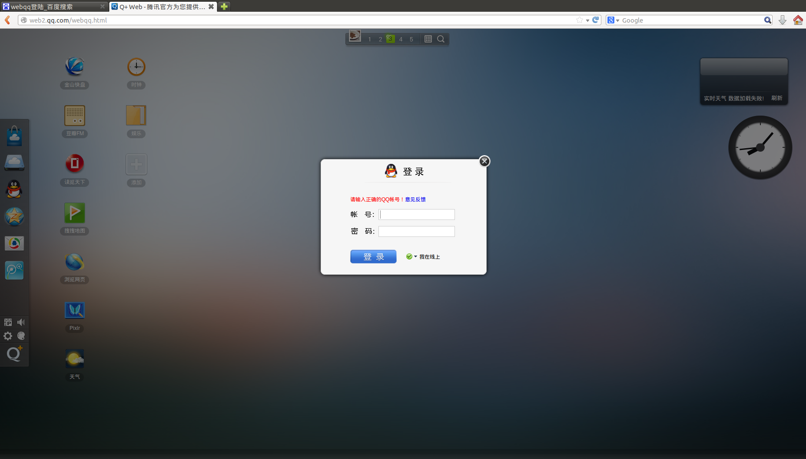
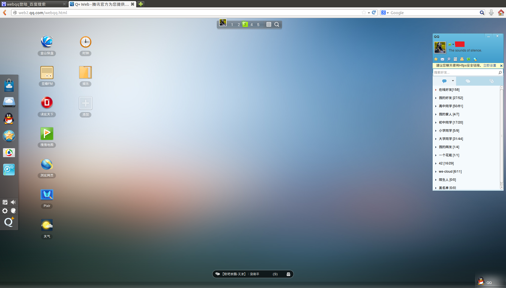

# Linux系统下QQ使用方法
# AUTH:服部半藏
QQ作为常用的即时通讯工具，在我们的生活中扮演了很重要的角色。但是QQ在windows，MAC OSX和移动设备上使用起来很方便，但是在Linux上的表现却不尽如人意。下面就介绍几种常用的方法。
## Web QQ
WEB QQ（Web QQ腾讯公司推出的使用网页方式上QQ的服务，特点是无需下载和安装QQ软件，只要能打开Web QQ的网站就可以登录QQ与好友保持联系。具有Web产品固有的便利性，同时在Web上最大限度的保持了客户端软件的操作习惯。更丰富的好友动态、更开阔的聊天模式、更实时的资讯查看、还有休闲音乐伴随，Web QQ将为我们提供一个愉快的网络起点。2009年9月15日正式上线。）

### [webqq 传送门](http://web2.qq.com/) 

### 使用方法
+ 打开浏览器，输入webqq，点击搜索

+ 找到“我的QQ – 能在网页上直接聊QQ”单击进入

+ 打开后显示如下界面（在这里要提示一下smart QQ是在原版QQ上做的改善，只保留了常用的几个功能，更像是手机QQ，而原版web QQ则偏重于娱乐，里面可以添加各种小应用，更像是一个操作系统，以个人喜好而定）

+ 我们先选择原版web QQ，单击后进入一个类似于windows桌面的界面，里面有一些预设的小应用，当然也可以自己添加。

+ 点击左边栏的QQ图标，会弹出登陆框，这时输入用户名密码，点击登录即可。

+ 登陆后的界面如图所示

+ 点击smart QQ后会弹出如下界面，直接登陆即可

+ 陆后界面如下，非常类似于手机QQ

